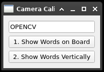
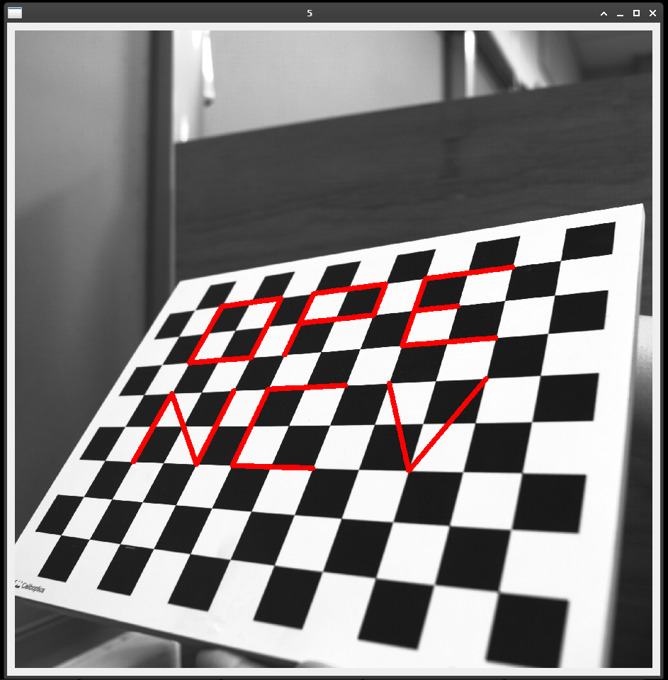
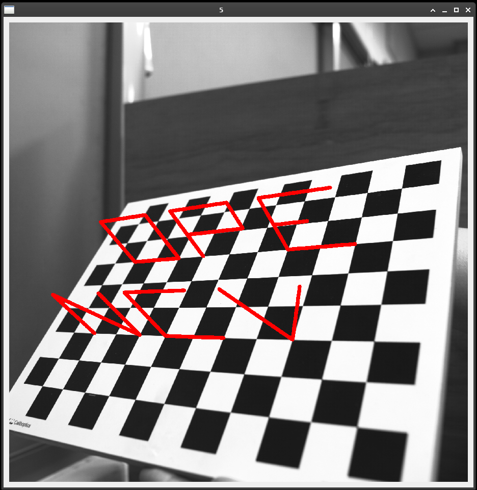

# augmented-reality-opencv

A simple example of augmented reality using OpenCV.

This application shows most 6 English characters on chessboards.

To execute: `python main.py`

## Screenshot

- Show given word on chessboards:  
  

- Show given word vertically on chessboards:  
  